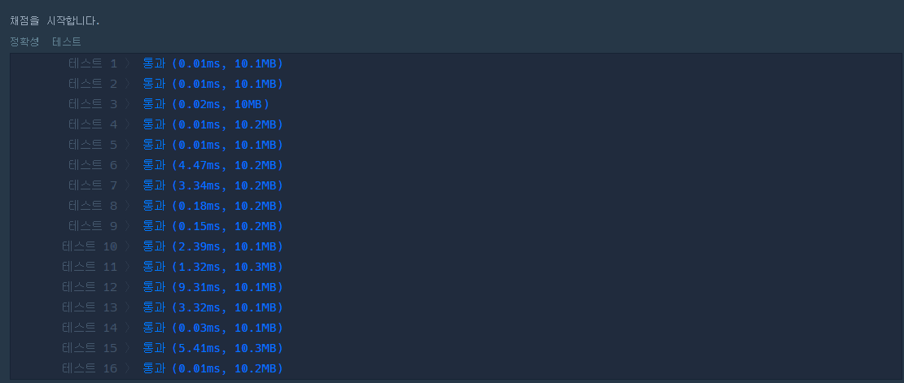
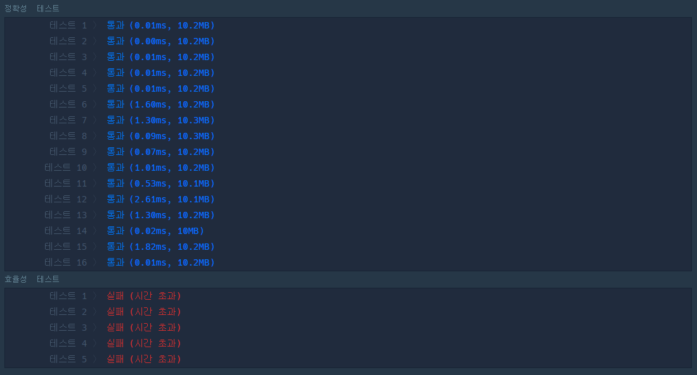
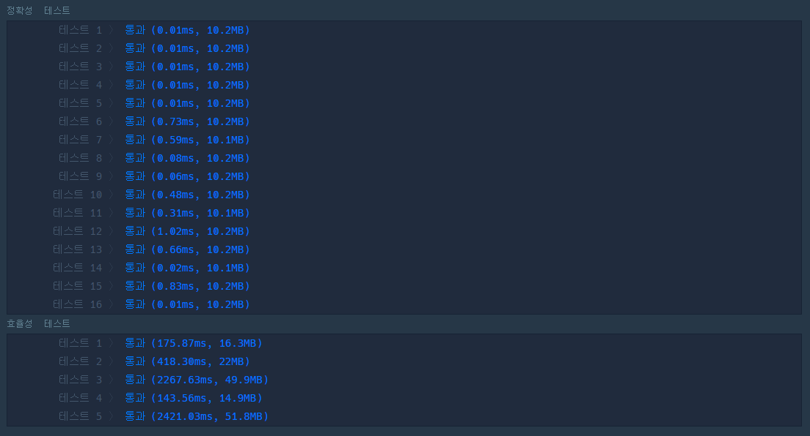

# 프로그래머스 알고리즘 문제 ( 더 맵게 )

#### 사용 언어 - python

#### 사용 자료구조 - heap


### 첫번째 코드

원래는 heap을 사용해야 하지만 일단 스택으로 한 번 풀어 보았다.

``` python
def shake(scoville):
    return scoville.pop(0)+(scoville.pop(0)*2)

def solution(scoville, K):
    shakeCnt = 0
    while min(scoville) < K:
        if len(scoville)>1:
            scoville.sort()
            scoville.append(shake(scoville))
            shakeCnt+=1
        else:
            return -1
        
    return shakeCnt
```



역시나 heap 문제라 효율성 테스트를 통과하지 못했다.

### 두번째 코드

while 문에서 min(scoville)을 처리하는 부분이 매번 sort를 통해 정렬을 하는데 굳이 최소 비교를 위해 하나씩 접근을 할 필요없기 때문에 

정렬 후 맨 앞 데이터를 비교하는 것으로 바꿨다 

if 문으로 -1 예외처리를 했는데 찾아보니 IndexError으로도 예외처리를 할 수 있어서 한 번 적용해봤다

``` python
def shake(scoville):
    return scoville.pop(0)+(scoville.pop(0)*2)

def solution(scoville, K):
    shakeCnt = 0
    scoville.sort()
    while scoville[0] < K:
        try:
            scoville.append(shake(scoville))
            scoville.sort()
        except IndexError:
            return -1
        shakeCnt+=1
        
    return shakeCnt
```



개선을 하니 효율이 조금 향상되었다 하지만 효율성 테스트는 통과하지 못했다

### 최종 코드

``` python
import heapq

def shake(scoville):
    return heapq.heappop(scoville)+heapq.heappop(scoville)*2

def solution(scoville, K):
    heapq.heapify(scoville)
    shakeCnt = 0
    while scoville[0] < K:
        try:
            heapq.heappush(scoville,shake(scoville))
        except IndexError:
            return -1
        shakeCnt+=1
        
    return shakeCnt
```



heap을 사용하니까 통과가 되었다!


